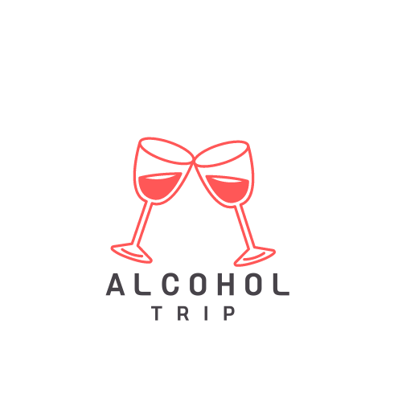

# 🍺알콜 트립
## 티미름

 

[프로젝트 바로가기](https://immense-chamber-32005.herokuapp.com/)

## ✔️팀원 소개 및 역할

조장: 김다겸

> 백엔드, 헤로쿠 배포, 맵 기능, 검색 기능, 로그인, 유저페이지 등 구현

조원: 김문경

> 백엔드, 크롤링, 좋아요, 식당 모델, 검색, 맵 기능 등 구현

조원: 이정섭

> 프론트엔드, template 레이아웃 및 디자인 구현

조원: 황여원

> 백엔드, 댓글, 좋아요, 리뷰, 별점 기능 등 구현

   

 

## ✔️기간

221031 ~ 221107

 

## ✔️주제

> **술집 정보 및 후기 공유 커뮤니티**

 

## ✔️사용 기술

- HTML
- CSS
- JS
- Python
- Django
- Selenium
- Heroku

 

### ✔️후기
일주일간 진행한 나의 첫 세미프로젝트였고, 소셜로그인에 많은 시간을 쏟아부었다. django의 all auth 라이브러리를 사용하지 않고, 비동기적으로 작동하도록 하기위해서였다. 템플릿에서 자바스크립트로 네이버, 카카오 API에 요청을 보낸 후 그에 대한 유저의 정보의 응답을 받은 후, axios 통신으로 서버에 해당 내용을 보냈다. 서버에서는 해당 내용들을 검사하고 회원가입 및 로그인하는 로직을 구현하였다. 동기적으로 작동하는 django에서 이렇게 비동기적으로 동작하도록 하는 부분에서 익숙치 않아 힘든 점이 있었지만, 비동기가 어떻게 작동하는지 이번 프로젝트를 통해 더 정확히 알 수 있던 계기가 되었다.

처음 조장을 맡아보면서 힘든 점도 많았지만 더 책임감을 가지고 우리 프로젝트의 퀄리티를 높이려 노력했던 것 같다. 팀원들이 팀장인 나의 말을 잘 따라줘서 좋았다.

여태까지 배운 장고의 내용들에 더해 추가적인 기능들을 구현하면서 시간을 많이 들여서 다른 기능을 많이 구현하지 못한 점이 아쉬웠다. 다음 프로젝트에서는 이런 부분을 보완해서 새로운 기술을 적용하는데도 시간을 줄이고, 더 많은 기능을 구현하려고 노력할 것이다.
